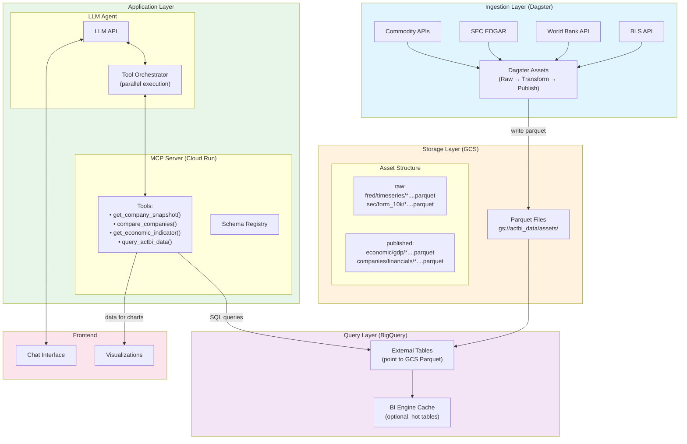
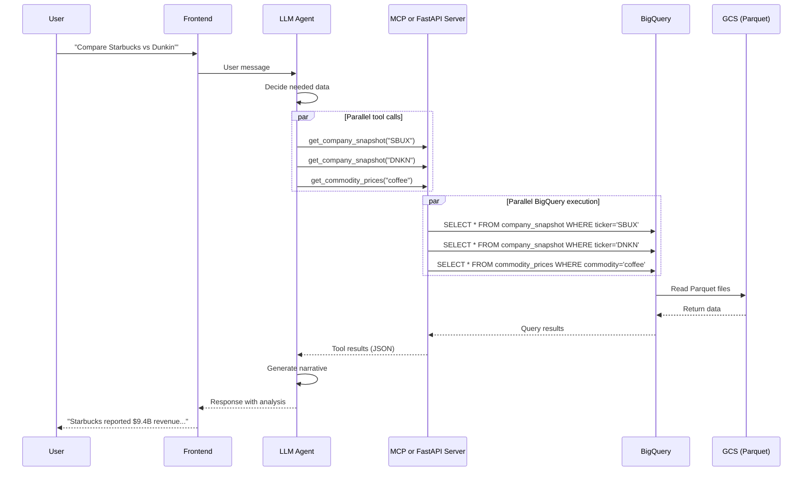

# Architecture

This document explains how the actBI data pipeline is designed and why we made the choices we did. If you want to understand the system deeply or contribute significant changes, start here.

## Table of Contents

1. [System Overview](#system-overview)
2. [Design Principles](#design-principles)
3. [Flexible DAG Architecture](#flexible-dag-architecture)
4. [Partition Strategy](#partition-strategy)
5. [Asset Naming Conventions](#asset-naming-conventions)
6. [Metadata Patterns](#metadata-patterns)
7. [Storage Organization](#storage-organization)
8. [Resource Framework](#resource-framework)
9. [Design Decisions](#design-decisions)

---

## System Overview

### The Big Picture

```
External APIs → Raw Assets → Transformed Assets → Published Assets → User Tools
     ↓              ↓               ↓                    ↓              ↓
  FRED API      Parquet       Cleaned &             LLM-ready      DuckDB queries
  BLS API       files         validated             partitions     Jupyter notebooks
  World Bank                  Enriched              Semantic       Custom LLM tools
  SEC EDGAR                   Calculated            naming
```

### System Architecture

The following diagram shows the complete data flow from external APIs through to user-facing applications:



### Data Flow

1. **Ingest** - Fetch raw data from external APIs (FRED, BLS, World Bank, SEC)
2. **Store** - Save as Parquet files in hierarchical directories
3. **Transform** - Clean, validate, enrich (number of steps varies)
4. **Publish** - Create LLM-ready assets with semantic partitions
5. **Analyze** - Query with DuckDB, load into Jupyter, or access via LLM tools

### Query Flow Example

This sequence diagram shows how a user query flows through the system, demonstrating parallel tool execution:



### Technology Stack

- **Dagster** - Orchestration framework (asset-based paradigm)
- **Pandas** - Data manipulation
- **Parquet** - Columnar storage format (efficient, compact)
- **DuckDB** - SQL analytics directly on Parquet files
- **Python 3.12** - Modern Python with type hints

---

## Design Principles

### 1. Data Quality First

**Why:** Businesses make real decisions based on this data. A wrong GDP figure could lead to bad strategic choices. Bad unemployment data could misguide hiring decisions.

**How we ensure quality:**
- Validate data at every boundary (API responses, file loads, transformations)
- Log data quality issues explicitly
- Fail fast rather than propagate errors
- Include lineage metadata (where did this data come from?)
- Test transformations with real-world edge cases

**Example:**
```python
def validate_fred_response(data: dict) -> pd.DataFrame:
    """Validate FRED API response structure."""
    if 'observations' not in data:
        raise ValueError('Missing observations in FRED response')

    df = pd.DataFrame(data['observations'])

    required_columns = ['date', 'value']
    missing = set(required_columns) - set(df.columns)
    if missing:
        raise ValueError(f'Missing required columns: {missing}')

    return df
```

### 2. Flexible Architecture

**Why:** Not all data needs the same transformation complexity. Some data goes straight from API to user (2 layers). Other data needs parsing, enrichment, and validation (3+ layers).

**How we achieve flexibility:**
- No rigid "three-layer architecture" requirement
- Add intermediate nodes only when they provide value
- Use helper functions for simple transforms
- Keep the DAG as simple or complex as needed

**Examples:**

**Simple (2 layers):**
```
bronze/world_bank/timeseries[USA]
    ↓
gold/economic/growth/gdp[USA]
```

**Complex (3 layers):**
```
bronze/sec/form_10k[0000320193|FY2023]
    ↓
silver/sec/form_10k_financials[0000320193|FY2023]
    ↓
gold/companies/financials/annual_report[AAPL|FY2023]
```

### 3. AI Native

**Why:** LLMs need to discover and understand our data. Asset names, metadata, and structure must support AI integration.

**How we design for AI:**
- Asset names match natural language queries (`economic/growth/gdp` not `econ_gdp_data_v2`)
- Metadata includes `questions_answered` field
- Published assets are pre-aggregated (reduces LLM context window usage)
- Semantic partitions (`US`, `AAPL`) instead of opaque IDs (`0000320193`)

**Example:**
```python
@dg.asset(
    key_prefix=['gold', 'economic', 'growth'],
    name='gdp',
    metadata={
        'layer': 'gold',
        'questions_answered': [
            'What is GDP for {country}?',
            'How has {country} economy grown?',
            'Show me economic growth trends',
        ],
        'visibility': 'llm_accessible',
    }
)
```

### 4. Partition-Based Scalability

**Why:** Creating 100 individual assets for 100 countries is unmaintainable. Partitions let you scale to 1000+ countries with the same code.

**How we use partitions:**
- One asset definition, many instances (countries, indicators, companies)
- Independent materialization (update US without touching China)
- Parallel processing (Dagster can materialize partitions concurrently)
- Easy to add new instances (update partition list, not asset code)

---

## Flexible DAG Architecture

### The Old Way (Rigid Layers)

Some data pipelines enforce a strict layered architecture:

```
Bronze Layer (Raw) → Silver Layer (Cleaned) → Gold Layer (Aggregated)
```

**Problems:**
- Not all data needs all layers
- Forces unnecessary transformations
- Makes simple tasks complex

### Our Way (Flexible DAG)

Assets form a **dependency graph** with variable depth:

```
Source Nodes → (Optional Intermediate Nodes) → Leaf Nodes
```

**The only requirements:**
1. **Source nodes** have no upstream dependencies (fetch from APIs)
2. **Leaf nodes** are terminal (no downstream assets depend on them)
3. **Intermediate nodes** (if any) connect source to leaf

**Everything else is flexible.**

### Examples from Our Pipeline

#### Economic Indicators (2 Layers)

```
bronze/fred/all_series (unpartitioned - all 5 series)
bronze/world_bank/timeseries[USA] (all indicators for one country)
    ↓
gold/economic/growth/gdp[USA] (filters at runtime)
```

**Why 2 layers?**
- Raw data is already clean enough
- Transform logic is simple (format date, select columns, filter by indicator)
- Helper functions handle the transformation inline
- FRED/BLS have so few series they're unpartitioned (5 and 6 series respectively)

#### SEC Filings (3 Layers)

```
bronze/sec/form_10k[0000320193|FY2023]
    ↓
silver/sec/form_10k_financials[0000320193|FY2023]
    ↓
gold/companies/financials/annual_report[AAPL|FY2023]
```

**Why 3 layers?**
- Raw filing is just metadata (filing date, URL)
- Parsed layer extracts financials (revenue, profit, ratios)
- Published layer maps CIK → ticker, adds context

#### Future: Complex Analysis (4+ Layers)

```
Source Data
    ↓
Cleaned Data
    ↓
Calculated Metrics
    ↓
Cross-Country Comparisons
    ↓
Published Rankings
```

**The point:** Use as many layers as your data needs. No more, no less.

---

## Partition Strategy

### The Problem

You have similar data for different instances:
- GDP data for 20 countries
- Unemployment rates for 50 states
- Quarterly earnings for 500 companies

Do you create 500 individual assets? No—you use partitions.

### Single-Dimensional Partitions

**Use case:** One key dimension (country, series, company)

**Example: FRED Economic Series**

```python
from pipelines.partitions import fred_series_partitions

fred_series_partitions = dg.StaticPartitionsDefinition([
    'GDP', 'UNRATE', 'CPIAUCSL', 'PCE', 'FEDFUNDS'
])

@dg.asset(
    key_prefix=['bronze', 'fred'],
    name='timeseries',
    partitions_def=fred_series_partitions,
    metadata={'layer': 'bronze'},
)
def fred_timeseries(context):
    series_id = context.partition_key  # 'GDP', 'UNRATE', etc.
    # Same fetch logic for all series
```

**Result:** 5 partitions from one asset definition.

### Multi-Dimensional Partitions

**Current status:** We previously used multi-dimensional partitions (e.g., country × indicator for World Bank data), but this created a partition explosion and runtime complexity. We've simplified to single-dimension partitions across the pipeline.

**Example: World Bank Data (Current Single-Dimension Approach)**

```python
from pipelines.partitions import worldbank_country_partitions

worldbank_country_partitions = dg.StaticPartitionsDefinition([
    'USA', 'CHN', 'JPN', 'DEU', 'GBR', 'FRA', 'KOR', 'ITA', 'GRC', 'EUU',
    'CAN', 'IND', 'BRA', 'AUS', 'MEX', 'ESP', 'NLD', 'RUS', 'SAU', 'TUR'
])

# Creates 20 partitions (one per country, all indicators in each)

@dg.asset(partitions_def=worldbank_country_partitions)
def worldbank_timeseries(context, world_bank_api: WorldBankApiResource):
    country = context.partition_key  # Simple string: 'USA', 'CHN', etc.

    # Fetch ALL indicators for this country in one partition
    all_data = []
    for indicator in WORLDBANK_INDICATORS:
        df = world_bank_api.get_indicator(indicator, [country])
        df['indicator'] = indicator
        all_data.append(df)

    return pd.concat(all_data, ignore_index=True)
```

**Benefits:**
- No partition explosion (20 partitions instead of 160)
- Simpler runtime logic (no `.keys_by_dimension`)
- Direct dependencies work naturally (same partition flows through bronze→gold)
- Filter by indicator at runtime when needed

### Source-Native vs Semantic Partitions

This is a key architectural decision.

#### Current Approach: Consistent 3-Letter Country Codes

**Simplified design:** We now use **3-letter country codes throughout** (bronze and gold layers).

- **Countries:** 3-letter codes everywhere (`USA`, `CHN`, `JPN`)
- **Companies:** Stock tickers (`AAPL`, `MSFT`)
- **Indicators:** World Bank native codes (`NY.GDP.MKTP.CD`, `SL.UEM.TOTL.ZS`)

**Why this works:**
- World Bank API uses 3-letter codes natively (no mapping needed)
- Bronze and gold layers use the same partition keys
- Direct dependencies flow naturally (same partition definition)
- No partition mapping complexity

#### The Bridge: Reference Assets for Routing

**Problem:** Gold assets need to know which data source to use for each indicator.

**Solution:** Crosswalk assets that map indicators to source series, plus runtime filtering.

**Example: Indicator Crosswalk**

```python
@dg.asset(key_prefix=['silver', 'reference'], name='indicator_crosswalk')
def indicator_crosswalk() -> pd.DataFrame:
    data = [
        # canonical_slug | source | source_series_id | display_name
        ('gdp', 'fred', 'GDP', 'Gross Domestic Product'),
        ('unemployment', 'fred', 'UNRATE', 'Unemployment Rate'),
        ('gdp', 'worldbank', 'NY.GDP.MKTP.CD', 'GDP Current USD'),
        ('unemployment', 'worldbank', 'SL.UEM.TOTL.ZS', 'Unemployment Rate'),
    ]
    return pd.DataFrame(data, columns=['canonical_slug', 'source', 'source_series_id', 'display_name'])
```

**Usage in Gold Assets (Direct Dependencies):**

```python
@dg.asset(
    key_prefix=['gold', 'economic', 'labor_market'],
    name='unemployment',
    partitions_def=semantic_countries,  # 'USA', 'CHN', 'JPN', ...
    ins={
        'bronze_fred_all_series': dg.AssetIn(
            key=dg.AssetKey(['bronze', 'fred', 'all_series']),
        ),
    },
    metadata={'layer': 'gold', 'visibility': 'llm_accessible'},
)
def unemployment(
    context: dg.AssetExecutionContext,
    bronze_fred_all_series: pd.DataFrame,  # Unpartitioned - all series
    bronze_world_bank_timeseries: pd.DataFrame,  # Same partition - already filtered to this country
) -> pd.DataFrame:
    """Unemployment rate by country."""
    country = context.partition_key  # 'USA', 'CHN', etc.

    # Filter at runtime based on country
    if country == 'USA':
        # FRED data - filter from unpartitioned asset
        return (
            bronze_fred_all_series
            .query("series_id == 'UNRATE'")
            .drop(columns=['series_id'])
        )
    else:
        # World Bank data - already filtered to this country, just select indicator
        return (
            bronze_world_bank_timeseries
            .query("indicator == 'SL.UEM.TOTL.ZS'")
            .drop(columns=['indicator'])
        )
```

**Key pattern:** Direct dependencies through function parameters, filter DataFrames at runtime. No `AllPartitionMapping` or `load_asset_value` needed.

---

## Asset Naming Conventions

### Why Naming Matters

Asset names serve two purposes:

1. **Human navigation** - Developers need to find assets quickly
2. **LLM discovery** - AI tools need to understand what data exists

Good names are:
- **Descriptive** - `economic/growth/gdp` tells you what it is
- **Hierarchical** - Categories help with organization
- **Natural** - Match how humans and LLMs talk about data

### Naming Rules (Medallion Architecture)

We use a **medallion architecture** with three layers: bronze, silver, and gold.

**Bronze layer (raw ingestion):**

```
bronze/<source>/<data_type>
```

**Examples:**

```
bronze/fred/timeseries
bronze/bls/timeseries
bronze/world_bank/timeseries
bronze/sec/form_10k
bronze/noaa/daily
bronze/nasa_power/daily
```

**Silver layer (cleaned, validated, reference data):**

```
silver/<source>/<data_type>
silver/reference/<mapping_name>
```

**Examples:**

```
silver/sec/form_10k_financials
silver/sec/form_13f
silver/reference/indicator_id_crosswalk
silver/reference/company_registry
silver/reference/institution_registry
```

**Gold layer (semantic, LLM-accessible):**

```
gold/<category>/<subcategory>/<indicator>
```

**Examples:**

```
gold/economic/growth/gdp
gold/economic/labor_market/unemployment
gold/economic/prices/inflation
gold/economic/monetary/interest_rate
gold/economic/trade/balance
gold/economic/fiscal/government_debt
gold/companies/financials/annual_report
gold/companies/insider/insider_activity
gold/institutions/portfolio/portfolio_holdings
gold/climate/temperature/average
gold/agriculture/weather/daily
```

### What to Avoid

❌ **Abbreviations:** `econ_gdp` → Use `economic/growth/gdp`
❌ **Version numbers:** `gdp_v2` → Use Git for versioning
❌ **Underscores everywhere:** `fred_raw_gdp_data` → Use `/` for hierarchy
❌ **Opaque codes:** `asset_1234` → Use descriptive names

---

## Metadata Patterns

### Why Metadata Matters

Metadata answers:
- "How many records are in this dataset?"
- "What date range does it cover?"
- "What questions can this asset answer?"
- "Where did this data come from?"

This information is crucial for:
- **Debugging** - Understanding what went wrong
- **Monitoring** - Detecting anomalies
- **LLM discovery** - Helping AI find relevant data

### Required Metadata for Source Nodes

```python
metadata = {
    'node_type': 'source',
    'visibility': 'internal',
    'source': 'federal_reserve',  # Or 'world_bank', 'bls', 'sec_edgar'
}
```

### Required Metadata for Leaf Nodes

```python
metadata = {
    'node_type': 'leaf',
    'visibility': 'llm_accessible',
    'questions_answered': [
        'What is {indicator} for {country}?',
        'How has {indicator} changed over time?',
    ],
}
```

### Runtime Metadata (via context.add_output_metadata)

```python
@dg.asset
def gdp_data(context):
    df = fetch_gdp_data()

    context.add_output_metadata({
        'num_records': len(df),
        'date_range_start': str(df['date'].min()),
        'date_range_end': str(df['date'].max()),
        'source': 'fred:GDP',
    })

    return df
```

### MetadataBuilder Pattern

For consistency, we provide a builder:

```python
from pipelines.utils.metadata import MetadataBuilder

metadata = (
    MetadataBuilder()
    .with_record_count(df)
    .with_date_range(df, 'date')
    .with_series_id(series_id)
    .build()
)
context.add_output_metadata(metadata)
```

---

## Storage Organization

### Directory Structure (Hive-Style Partitioning)

Assets are stored using **Hive-style partitioning** for compatibility with Spark, DuckDB, Athena, and other query engines. Each partition is a directory with `column=value` format containing a `data.parquet` file.

```
_data/assets/
├── bronze/
│   ├── fred/
│   │   └── all_series.parquet           # Unpartitioned (all 5 series)
│   ├── bls/
│   │   └── all_series.parquet           # Unpartitioned (all 6 series)
│   ├── world_bank/
│   │   └── timeseries/
│   │       ├── partition=USA/
│   │       │   └── data.parquet         # All indicators for USA
│   │       ├── partition=CHN/
│   │       │   └── data.parquet         # All indicators for CHN
│   │       └── partition=JPN/
│   │           └── data.parquet         # All indicators for JPN
│   └── sec/
│       ├── form_10k/
│       │   ├── partition=AAPL/
│       │   │   └── data.parquet
│       │   └── partition=MSFT/
│       │       └── data.parquet
│       └── form_13f/
│           ├── partition=0001067983/    # Institution CIK
│           │   └── data.parquet
│           └── partition=0001364742/
│               └── data.parquet
├── silver/
│   ├── reference/
│   │   ├── indicator_crosswalk.parquet
│   │   ├── company_registry.parquet
│   │   └── institution_registry.parquet
│   └── sec/
│       └── form_10k_financials/
│           ├── partition=AAPL/
│           │   └── data.parquet
│           └── partition=MSFT/
│               └── data.parquet
└── gold/
    ├── economic/
    │   ├── growth/
    │   │   └── gdp/
    │   │       ├── partition=USA/
    │   │       │   └── data.parquet
    │   │       ├── partition=CHN/
    │   │       │   └── data.parquet
    │   │       └── partition=JPN/
    │   │           └── data.parquet
    │   └── labor_market/
    │       └── unemployment/
    │           ├── partition=USA/
    │           │   └── data.parquet
    │           └── partition=CHN/
    │               └── data.parquet
    └── companies/
        └── financials/
            └── annual_report/
                ├── partition=AAPL/
                │   └── data.parquet
                └── partition=MSFT/
                    └── data.parquet
```

### Partition Key to Path Mapping

**Single-dimensional (uses `partition=` prefix):**
- Partition key: `"USA"`
- Path: `bronze/world_bank/timeseries/partition=USA/data.parquet`

**Company partitions:**
- Partition key: `"AAPL"`
- Path: `bronze/sec/form_10k/partition=AAPL/data.parquet`

**Institution partitions:**
- Partition key: `"0001067983"`
- Path: `bronze/sec/form_13f/partition=0001067983/data.parquet`

**Non-partitioned assets:**
- Asset key: `['bronze', 'fred', 'all_series']`
- Path: `bronze/fred/all_series.parquet`

**Note:** We use single-dimension partitions exclusively. The multi-dimensional approach created partition explosion and runtime complexity.

### Why Parquet?

**Benefits:**
- Columnar storage (efficient for analytics)
- Compressed (saves disk space)
- Schema included (self-describing)
- Fast to read subsets of columns
- Works great with DuckDB

**Trade-offs:**
- Not human-readable (use DuckDB or pandas to view)
- Slightly more complex than CSV
- Requires libraries to read

**Verdict:** Worth it for performance and efficiency.

---

## Resource Framework

### Design Pattern

Resources use Dagster's `ConfigurableResource` pattern:

```python
from dagster import ConfigurableResource

class FredApiResource(ConfigurableResource):
    api_key: str  # Configuration field

    def get_series(self, series_id: str):
        """Business logic method."""
        client = Fred(api_key=self.api_key)
        return client.get_series(series_id)
```

### Registration

Resources are registered in `definitions.py`:

```python
import dagster as dg

defs = dg.Definitions(
    assets=[...],
    resources={
        'fred_api': FredApiResource(api_key=dg.EnvVar('FRED_API_KEY')),
        'world_bank_api': WorldBankApiResource(),  # No auth needed
        'bls_api': BlsApiResource(api_key=dg.EnvVar('BLS_API_KEY')),
        'sec_edgar': SecEdgarResource(identity=get_sec_identity()),
    }
)
```

### Usage

Resources are injected via function parameters:

```python
@dg.asset
def gdp_data(context, fred_api: FredApiResource):  # ← Injected
    data = fred_api.get_series('GDP')
    return pd.DataFrame(data)
```

### Benefits

1. **Testability** - Swap real API with mock in tests
2. **Configuration** - Secrets managed via `EnvVar`, not hardcoded
3. **Reusability** - One resource, many assets
4. **Type safety** - Type hints enable IDE autocomplete

---

## Design Decisions

### Why Dagster (Not Airflow)?

**Dagster advantages:**
- Asset-based paradigm (not just tasks)
- First-class support for partitions
- Rich type system and metadata
- Better developer experience (UI, testing)
- Modern Python patterns

**Trade-offs:**
- Smaller community than Airflow
- Fewer integrations (but growing)

**Verdict:** Dagster's asset model fits our use case perfectly.

### Why Parquet (Not CSV)?

**Parquet advantages:**
- 10x smaller files
- 10x faster queries (columnar)
- Built-in schema
- DuckDB integration

**Trade-offs:**
- Not human-readable
- Requires tools to view

**Verdict:** Performance wins.

### Why Partitions (Not Individual Assets)?

**Partition advantages:**
- One definition, many instances
- Easy to scale (add countries, companies, etc.)
- Independent materialization
- Parallel processing

**Trade-offs:**
- Slightly more complex code
- Need to understand partition key access

**Verdict:** Essential for scalability.

### Why Consistent Partitions (Not Multi-Dimensional)?

**Why not multi-dimensional partitions (country × indicator)?**
- Partition explosion (20 countries × 8 indicators = 160 partitions)
- Complex runtime logic (`.keys_by_dimension`, `AllPartitionMapping`)
- Harder to track provenance through the DAG

**Why not semantic everywhere (2-letter codes)?**
- World Bank API uses 3-letter codes natively
- No need for extra mapping layer when source format works for users

**Verdict:** Use single-dimension partitions with 3-letter country codes throughout. Filter by indicator at runtime when needed.

---

## Summary

The actBI pipeline architecture is designed for:

1. **Data quality** - Validate at every step, fail fast, track lineage
2. **Flexibility** - Variable DAG depth based on data complexity
3. **Scalability** - Partition-based design supports thousands of instances
4. **AI integration** - Semantic naming, rich metadata, pre-aggregated outputs
5. **Developer experience** - Clear patterns, good tooling, maintainable code

**Key patterns to remember:**
- Use partitions for logically similar data (same structure, different instances)
- Single-dimension partitions only (avoid multi-dimensional complexity)
- Unpartitioned assets for small datasets (< 10 items like FRED/BLS)
- Same partition definitions flow through bronze → silver → gold (direct dependencies)
- Filter DataFrames at runtime when needed (no partition mapping)
- Add intermediate nodes only when they provide value
- Metadata and naming matter for LLM discovery

**Next steps:**
- See [DATA_SOURCES.md](DATA_SOURCES.md) for specific data source details
- Read [ADDING_DATA_SOURCES.md](ADDING_DATA_SOURCES.md) to add your own data
- Check [OPERATIONS.md](OPERATIONS.md) for running and monitoring the pipeline
